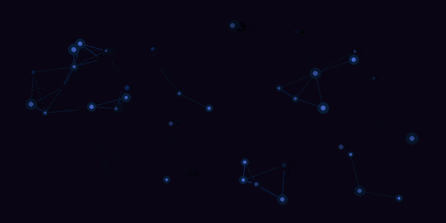

# Lucas Van Vonderen

**Full Stack Developer**

Building tools, automating infrastructure, and tinkering with AI agents.

---

### About Me

- 🔧 Full stack developer with a passion for self-hosting and homelab infrastructure
- 🤖 Building AI agents and MCP servers to extend what's possible with LLMs
- 🏗️ DevOps-minded — if it can be automated, it should be
- 🎮 Occasional game dev and side-project enthusiast

---

### Languages

  
  
  
  
  

### Tools & Platforms

  
  
  
  
  
  
  

### Devices & Hardware

  
  
  
  

### Runs on Linux

  
  
  

---

